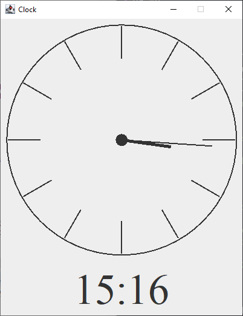

# Clock
A Java implementation of a Clock, with AWT and Swing.

# Image example

# TODO

 - [x] Option to have time abstracted out of component
 - [x] Add JLabel digital time to JFrame.
 - [ ] Remove hard-coding of clock location in frame.
 - [ ] Clock theme options?

# File Explanation

The following paragraphs detail what each file, within the [source directory](src/) aims to achieve

## Clock

## ClockComponent

## ClockComponent
